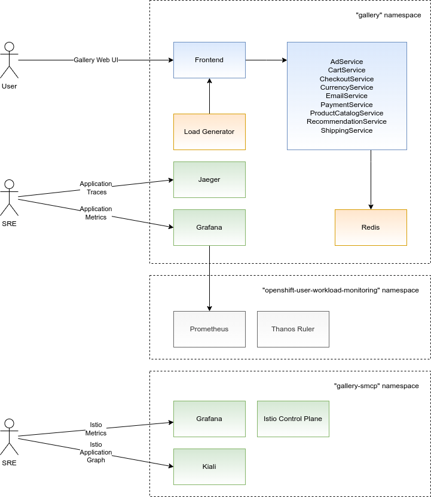
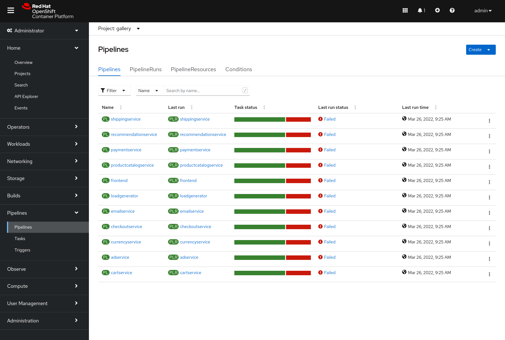
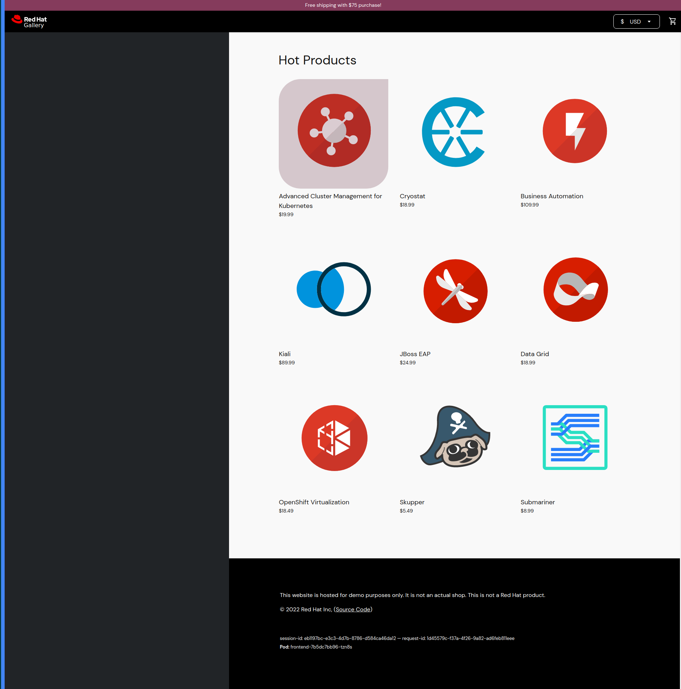
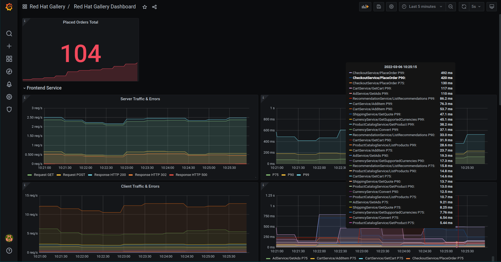
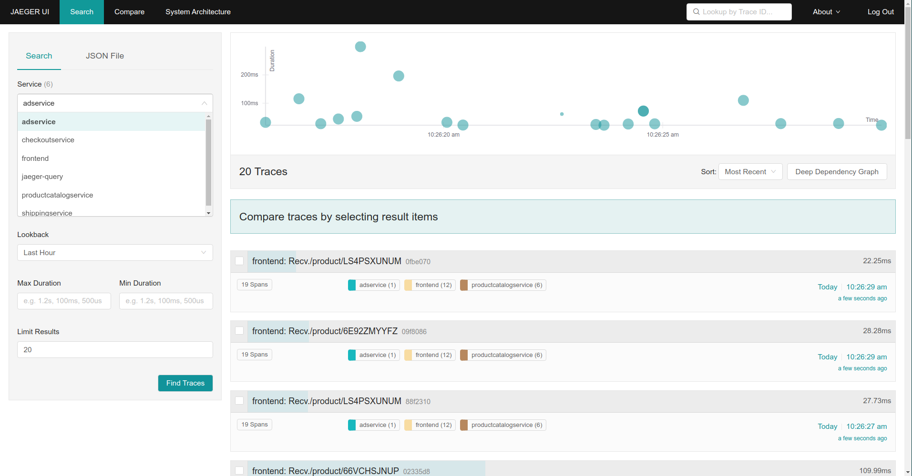
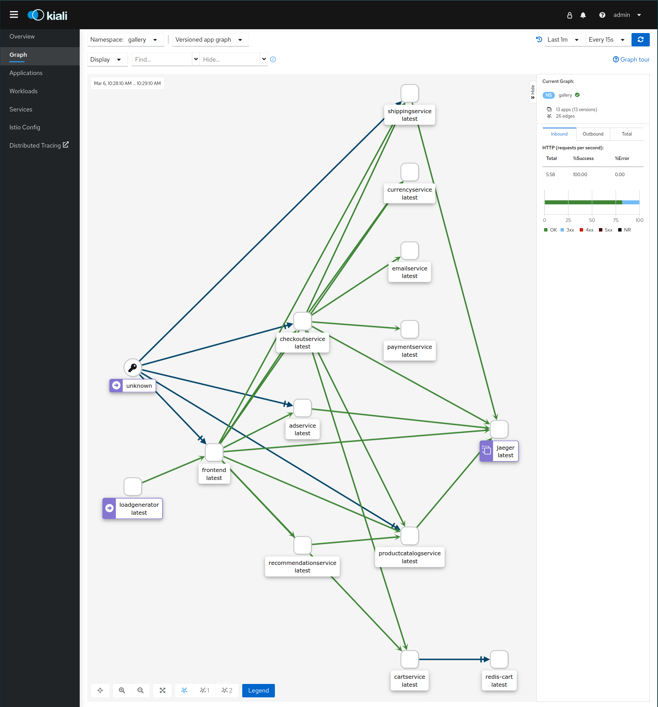
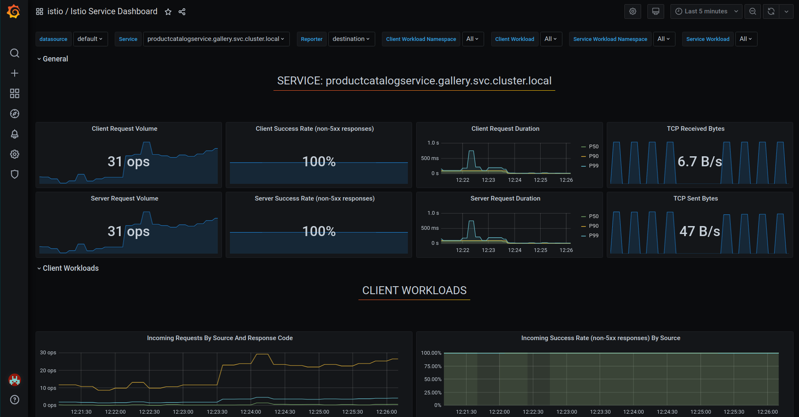
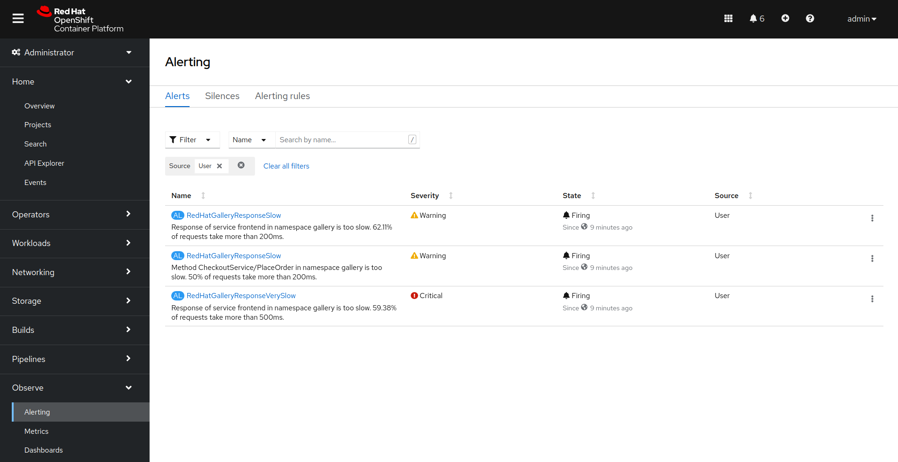

# Red Hat Gallery

## Deployment diagram



The namespace where the Service Mesh control plane was deployed cannot be used for application workloads. Service Mesh will refuse to enroll this namespace in the service mesh. That's why we are going to use two namespaces:

* **gallery** namespace includes:
  * Red Hat Gallery application
  * Custom Grafana instance that includes the Red Hat Gallery dashboard. We are deploying a custom Grafana instance, as Istio's Grafana instance doesn't seem to support deploying of custom dashboards.
  * Custom Jaeger instance. Having a Jaeger instance deployed in the same namespace as application simplifies the deployment.

* **gallery-smcp** namespace includes:
  * OpenShift Service Mesh control plane
  * Grafana dashboard showing metrics retrieved from Istio
  * Kiali dashboard showing the application graph

Application metrics are collected by a Prometheus server that comes as part of the OpenShift platform. This Prometheus is running in the **openshift-user-workload-monitoring** namespace. Monitoring alerts are also handled by the built-in OpenShift monitoring stack.

The following sections will walk you through the deployment process.

## Enabling monitoring of user workloads

We are going to leverage the OpenShift integrated monitoring stack to collect the Red Hat Gallery metrics. Enable monitoring of user-defined workloads on OpenShift:

```
$ (cat <<EOF
apiVersion: v1
kind: ConfigMap
metadata:
  name: cluster-monitoring-config
  namespace: openshift-monitoring
data:
  config.yaml: |
    enableUserWorkload: true
EOF
) | oc apply --filename -
```

See also [Enabling monitoring for user-defined projects](https://docs.openshift.com/container-platform/4.9/monitoring/enabling-monitoring-for-user-defined-projects.html).


## Deploying cluster operators

Deploy Elasticsearch, Jaeger, Kiali, and OpenShift Service Mesh operators.

```
$ oc apply --kustomize red-hat-gallery/elasticsearch-operator/base
```

```
$ oc apply --kustomize red-hat-gallery/jaeger-operator/base
```

```
$ oc apply --kustomize red-hat-gallery/kiali-operator/base
```

```
$ oc apply --kustomize red-hat-gallery/service-mesh-operator/base
```

Make sure that the csvs deployed successfully:

```
$ oc get csv --namespace openshift-operators
NAME                              DISPLAY                                          VERSION    REPLACES                     PHASE
elasticsearch-operator.5.3.4-13   OpenShift Elasticsearch Operator                 5.3.4-13                                Succeeded
jaeger-operator.v1.30.0           Red Hat OpenShift distributed tracing platform   1.30.0                                  Succeeded
kiali-operator.v1.36.7            Kiali Operator                                   1.36.7     kiali-operator.v1.36.6       Succeeded
servicemeshoperator.v2.1.1        Red Hat OpenShift Service Mesh                   2.1.1-0    servicemeshoperator.v2.1.0   Succeeded
```

You should find operators running in the `openshift-operators` project:

```
$ oc get pod --namespace openshift-operators
NAME                                                     READY   STATUS    RESTARTS         AGE
istio-node-zq2zx                                         4/4     Running   117              14d
istio-operator-6b9f65bbd6-l9j8c                          1/1     Running   0                9m20s
jaeger-operator-7c69c88fdf-t2mt5                         2/2     Running   0                10m
kiali-operator-5b7d8c4d85-dg5nk                          1/1     Running   0                9m54s
```

## Creating namespace for Service Mesh control plane

Create namespace `gallery-smcp`:

```
$ oc new-project gallery-smcp
```

## Deploying Service Mesh

Switch to `gallery-smcp` project if not already there:

```
$ oc project gallery-smcp
```

Install the service mesh control plane into the `gallery-smcp` namespace:

```
$ oc apply --kustomize red-hat-gallery/service-mesh-instance/overlays/development
```

Wait until the service mesh control plane deploys. Verify that the Kubernetes resources deployed successfully:

```
$ oc get --kustomize red-hat-gallery/service-mesh-instance/overlays/development
NAME                                       READY   STATUS       AGE
servicemeshmemberroll.maistra.io/default   0/0     Configured   40s

NAME                                               READY   STATUS            PROFILES      VERSION   AGE
servicemeshcontrolplane.maistra.io/control-plane   10/10   ComponentsReady   ["default"]   2.1.1     40s
```

Check that the Service Mesh components are running:

```
$ oc get pod
NAME                                                   READY   STATUS    RESTARTS   AGE
grafana-5b7b7fd9cc-br4gb                               2/2     Running   0          19m
istio-egressgateway-85c78bbb4d-bjgp7                   1/1     Running   0          19m
istio-ingressgateway-77787bb47f-5fd6r                  1/1     Running   0          19m
istiod-control-plane-6c86798bfb-tzf2m                  1/1     Running   0          19m
jaeger-59fb7bb78d-txxs8                                2/2     Running   0          19m
kiali-5f8f94b89c-kz7fw                                 1/1     Running   0          18m
prometheus-5f79f59868-qcrwl                            2/2     Running   0          19m
wasm-cacher-control-plane-6b88cb64bf-qrwlf             1/1     Running   0          19m
```

## Creating Red Hat Gallery namespace

Create namespace `gallery`:

```
$ oc new-project gallery
```

Enroll the `gallery` namespace in the service mesh whose control plane was deployed to the `gallery-smcp` namespace:

```
$ (cat <<EOF
apiVersion: maistra.io/v1
kind: ServiceMeshMember
metadata:
  name: default
spec:
  controlPlaneRef:
    name: control-plane
    namespace: gallery-smcp
EOF
) | oc apply --filename -
```

Check that the namespace was enrolled in service mesh successfully:

```
$ oc get --namespace gallery-smcp smmr default
NAME      READY   STATUS       AGE
default   1/1     Configured   7m16s
```

## Deploying Grafana

Switch to `gallery` project if not already there:

```
$ oc project gallery
```

Deploy Grafana operator into the `gallery` namespace. Note that if you are deploying into a different OpenShift namespace than `gallery`, you will need to update the namespace reference in `red-hat-gallery/grafana-operator/base/kustomization.yaml` accordingly. Deploy Grafana operator:

```
$ oc apply --kustomize red-hat-gallery/grafana-operator/base
```

Deploy Grafana instance into the `gallery` namespace. Note that if you are deploying into a different OpenShift namespace than `gallery`, you will need to update the namespace reference in `red-hat-gallery/grafana-instance/base/kustomization.yaml` accordingly. Deploy Grafana instance:

```
$ oc apply --kustomize red-hat-gallery/grafana-instance/overlays/service-mesh
```

> :warning: Read the output! There are times where not all items will be created on the first run of the command. Simply re-running the command can solve this. Items that have been already created will show as `unchanged`


Obtain the Grafana URL:

```
$ oc get route grafana-route --output jsonpath='https://{.spec.host}{"\n"}'
https://grafana-route-gallery.apps.mycluster.example.com
```

Use your browser to navigate to the Grafana URL. You should be able to log into Grafana using the login with OpenShift. There are no dashboards available in Grafana at this moment. We are going to deploy the application dashboard in just a little bit.

Retrieve the Grafana service accoung JWT token:

```
$ TOKEN=$(oc serviceaccounts get-token grafana-serviceaccount)
```

Open the Grafana data source definition and insert the service account token that you obtained from the previous command:

```
$ sed -i "s#<INSERT_JWT_TOKEN_HERE>#${TOKEN}#g" red-hat-gallery/grafana-dashboard/base/openshift-monitoring-grafanadatasource.yaml
```

Deploy Red Hat Gallery Grafana dashboard. Note that if you are deploying into a different namespace than `gallery`, you will need to update the namespace reference in `red-hat-gallery/grafana-dashboard/base/kustomization.yaml` and `red-hat-gallery/grafana-dashboard/base/conf/dashboard.json` accordingly. Deploy Grafana dashboard:

```
$ oc apply --kustomize red-hat-gallery/grafana-dashboard/base
```

After a short moment, the Red Hat Gallery dashboard will show up in Grafana.

## Deploying Jaeger

Switch to `gallery` project if not already there:

```
$ oc project gallery
```

Deploy Jaeger instance into the `gallery` namespace:

```
$ oc apply --kustomize red-hat-gallery/jaeger-instance/overlays/service-mesh
```

Obtain Jaeger dashboard URL:

```
$ oc get route jaeger --output jsonpath='https://{.spec.host}{"\n"}'
https://jaeger-gallery.apps.mycluster.example.com
```

Use your browser to navigate to the Jager dashboard URL. You should be able to log into Jaeger dashboard using the login with OpenShift.

## Building application images

There are two options to build application images:
1. Build images locally using Docker or Podman
2. Build images using Tekton Pipelines on OpenShift

### Building images locally

Note that you will need a working installation of Docker or Podman on your machine. The `make-docker-images.sh` build script assumes that you have Docker installed. If you don't have Docker installed and prefer using Podman, you can create a symbolic link from docker to podman like this:

```
$ sudo ln -s /usr/bin/podman /usr/local/bin/docker
```

The following command will build container images locally and push them to a container image registry. Replace the REPO_PREFIX with your registry before issuing the command:

> :warning: If building the images yourself, you need to insure that the following repos exist before running the below command:
> ```adservice    
> cartservice
> checkoutservice  
> currencyservice
> emailservice  
> frontend
> loadgenerator   
> paymentservice
> productcatalogservice  
> recommendationservice
> shippingservice
> ```
> You need to have admin rights on these repos. It may be advisable to create a robot account with proper permissions before continuing


```
$ TAG=latest \
  REPO_PREFIX=quay.io/red-hat-gallery \
  ./hack/make-docker-images.sh
```


Generate Kubernetes manifests for deploying the application:

```
$ TAG=latest \
  REPO_PREFIX=quay.io/red-hat-gallery \
  ./hack/make-release-artifacts.sh
```

Deploy the generated manifests to OpenShift:

```
$ oc apply --recursive --filename release/
```

Verify that the application pods started successfully:

```
$ oc get pod
NAME                                                  READY   STATUS    RESTARTS   AGE
adservice-56479d9977-v9z6n                            2/2     Running   0          47s
cartservice-5bdc485f66-b52cm                          2/2     Running   0          45s
checkoutservice-89b9b8685-8p9vj                       2/2     Running   0          46s
currencyservice-74f45d7f79-v529b                      2/2     Running   0          45s
emailservice-66996d454f-zqmnw                         2/2     Running   0          44s
frontend-7b5dc7bb96-tzn8s                             2/2     Running   0          46s
grafana-deployment-fcc844f68-96xm4                    2/2     Running   0          2m14s
grafana-operator-controller-manager-bbff97cc6-tpzzq   2/2     Running   0          5m46s
jaeger-684974d5d8-tvmtj                               2/2     Running   0          2m13s
loadgenerator-57cd859465-js97k                        2/2     Running   0          47s
paymentservice-754d5f79c9-jdt6b                       2/2     Running   0          47s
productcatalogservice-5ff9fb974f-kswx9                2/2     Running   0          47s
recommendationservice-844d54dc7-sh2cq                 2/2     Running   0          46s
redis-cart-5c458f56bc-z7m95                           2/2     Running   0          45s
shippingservice-78d5bf9ff7-7cqgr                      2/2     Running   0          47s
```

### Building images using Tekton

> :warning: The below instructions assume dynamic storage is available and configured in the cluster. The pipelines will hang waiting for a persistent volume which may never be created

First, install OpenShift Pipelines (Tekton) using:

```
$ oc apply --kustomize red-hat-gallery/openshift-pipelines-operator/base
```

Verify that the operator is running:

```
$ oc get pod --namespace openshift-operators | grep pipelines
openshift-pipelines-operator-6945f659f9-2lxlw   1/1     Running   0              4h28m
```

Verify that the openshift-pipelines control plane pods are running:

```
$ oc get pod --namespace openshift-pipelines
NAME                                                 READY   STATUS    RESTARTS   AGE
tekton-operator-proxy-webhook-697fccc9cc-b72s4       1/1     Running   0          5h2m
tekton-pipelines-controller-65c59d7f5c-mmqph         1/1     Running   0          5h2m
tekton-pipelines-webhook-75fff6f875-g7kfr            1/1     Running   0          5h2m
tekton-triggers-controller-756594b64d-zc6zk          1/1     Running   0          5h1m
tekton-triggers-core-interceptors-84bd74965b-tkqpf   1/1     Running   0          5h1m
tekton-triggers-webhook-5d96785c49-g6j24             1/1     Running   0          5h1m
tkn-cli-serve-f49cc4dfc-w54r4                        1/1     Running   0          5h
```

Switch to `gallery` project if not already there:

```
$ oc project gallery
```

Next, deploy Tekton pipelines for building the Gallery application images. Note that if you are deploying into a different namespace than `gallery`, you will need to update the namespace references in the manifests accordingly. Deploy pipelines for building the Gallery application images:

```
$ oc apply --kustomize red-hat-gallery/openshift-pipelines-gallery/base
```

The above command will create Tekton pipelines for building images for all the Gallery services. It will also start the pipelines immediately. The resulting images will be pushed to the OpenShift integrated registry. 

> :warning: Note that the last step of the pipeline triggers the re-deployment of the Gallery service. This step will fail as we haven't deployed the Gallery application yet. After we deploy the Gallery application, you can re-run the pipelines and they will succeed. Note that you will need to choose workspace = VolumeClaimTemplate when re-running the pipeline. 

The screenshot below shows the failed pipelines due to the Gallery aplication haven't been deployed yet:




### Deploying Red Hat Gallery application (After Pipeline Are Created)

Switch to `gallery` project if not already there:

```
$ oc project gallery
```

Generate Kubernetes manifests for deploying the application. If you haven't pushed the images into the OpenShift integrated registry, replace the REPO_PREFIX with your registry before issuing the command:

```
$ TAG=latest \
  REPO_PREFIX=image-registry.openshift-image-registry.svc.cluster.local:5000/gallery \
  ./hack/make-release-artifacts.sh
```

Deploy the generated manifests to OpenShift:

```
$ oc apply --recursive --filename release/
```

After the manifests have been created you need to restart the Pipelines with the VolumeClaimTemplate


After all of the builds have succeeded the pods should end in a `Running` state.

Verify that the application pods started successfully:

```
$ oc get pod -l app.kubernetes.io/managed-by!=tekton-pipelines
NAME                                                  READY   STATUS    RESTARTS   AGE
adservice-56479d9977-v9z6n                            2/2     Running   0          47s
cartservice-5bdc485f66-b52cm                          2/2     Running   0          45s
checkoutservice-89b9b8685-8p9vj                       2/2     Running   0          46s
currencyservice-74f45d7f79-v529b                      2/2     Running   0          45s
emailservice-66996d454f-zqmnw                         2/2     Running   0          44s
frontend-7b5dc7bb96-tzn8s                             2/2     Running   0          46s
grafana-deployment-fcc844f68-96xm4                    2/2     Running   0          2m14s
grafana-operator-controller-manager-bbff97cc6-tpzzq   2/2     Running   0          5m46s
jaeger-684974d5d8-tvmtj                               2/2     Running   0          2m13s
loadgenerator-57cd859465-js97k                        2/2     Running   0          47s
paymentservice-754d5f79c9-jdt6b                       2/2     Running   0          47s
productcatalogservice-5ff9fb974f-kswx9                2/2     Running   0          47s
recommendationservice-844d54dc7-sh2cq                 2/2     Running   0          46s
redis-cart-5c458f56bc-z7m95                           2/2     Running   0          45s
shippingservice-78d5bf9ff7-7cqgr                      2/2     Running   0          47s
```

## Using Red Hat Gallery application

Obtain the Red Hat Gallery URL:
```
$ oc get route \
    --namespace gallery-smcp \
    --selector maistra.io/gateway-name=frontend-gateway,maistra.io/gateway-namespace=gallery \
    --output jsonpath='http://{.items[*].spec.host}{"\n"}'
http://gallery-frontend-gateway-525eca1d5089dbdc-gallery-smcp.apps.mycluster.example.com
```

Use your web browser to navigate to the Gallery URL.



## Observing Red Hat Gallery application

Switch to `gallery` project if not already there:

```
$ oc project gallery
```

Red Hat Gallery Grafana URL:

```
$ oc get route grafana-route --output jsonpath='https://{.spec.host}{"\n"}'
https://grafana-route-gallery.apps.mycluster.example.com
```



Jaeger URL:

```
$ oc get route jaeger --output jsonpath='https://{.spec.host}{"\n"}'
https://jaeger-gallery.apps.mycluster.example.com
```



Kiali URL:

```
$ oc get route kiali --namespace gallery-smcp --output jsonpath='https://{.spec.host}{"\n"}'
https://kiali-gallery-smcp.apps.mycluster.example.com
```



Istio Grafana URL:

```
$ oc get route --namespace gallery-smcp grafana --output jsonpath='https://{.spec.host}{"\n"}'
https://grafana-gallery-smcp.apps.mycluster.example.com
```



## Failure injection

Switch to `gallery` project if not already there:

```
$ oc project gallery
```

Force the productcatalogservice to add extra latency when processing a request:

```
$ oc set env deploy/productcatalogservice EXTRA_LATENCY="70ms"
```

Remove the extra latency, restore the normal operation:

```
$ oc set env deploy/productcatalogservice EXTRA_LATENCY-
```

Red Hat Gallery comes with Prometheus alerts which will be fired if the service latency is too high:




## Uninstalling Red Hat Gallery

To uninstall you need to remove the artifacts which you installed earlier:

```
oc delete cm cluster-monitoring-config -n openshift-monitoring
oc delete project gallery gallery-smcp
oc delete og openshift-cluster-monitoring -n openshift-monitoring
oc delete og openshift-operators-redhat -n openshift-operators-redhat
oc label namespace openshift-operators-redhat openshift.io/cluster-monitoring-

#####
# Be careful removing the elasticsearch operator if you have relied on this somewhere else in the cluster!
#####
oc delete sub -n openshift-operators-redhat elasticsearch-operator
oc delete sub openshift-pipelines-operator
oc delete sub -n openshift-operators jaeger-product kiali-ossm servicemeshoperator
oc get csv --all-namespaces --output custom-columns=NAMESPACE:.metadata.namespace,NAME:.metadata.name --no-headers | grep -e kiali-operator -e jaeger-operator -e servicemeshoperator| while read NS NAME; do oc delete csv --namespace $NS $NAME; done
```

You may also want to remove the `enableUserWorkload` for `openshift-monitoring`

```
(cat <<EOF
apiVersion: v1
kind: ConfigMap
metadata:
  name: cluster-monitoring-config
  namespace: openshift-monitoring
data:
  config.yaml: |
    enableUserWorkload: false
EOF
) | oc apply --filename -
```
